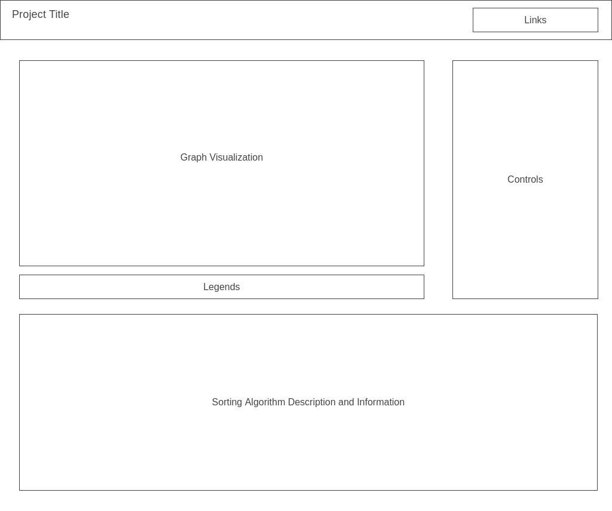

# Sorting Algorithm Visualizer

## Background

Sorting Algorithm Visualizer is an application that allows users to observe the intermediate steps of popular sorting algorithms (i.e. bubbleSort, quickSort, mergeSort). Some features include adjusting the speed at which the graph is sorted and selecting the amount of datapoints you would like to sort.

## Functionality and MVP

In Sorting Algorithm Visualizer users will be able to:

- Understand the different sorting algorithms when reading each description
- Adjust the speed at which the graph is being sorted
- Select the amount of datapoints you would like to sort
- A start/stop button for when you want to make changes

## Technologies

- HTML
- SCSS
- Javascript
- Webpack

## Implementation Timeline

1. Friday & Weekend: Finish creating classes
2. Monday: Implement the different algorithms
3. Tuesday: Implement the controls
4. Wednesday: Make UI more appealing
5. Thursday morning: Testing for bugs

## UI

